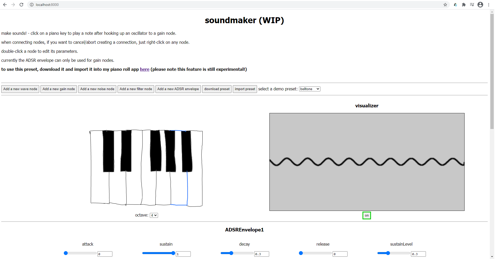
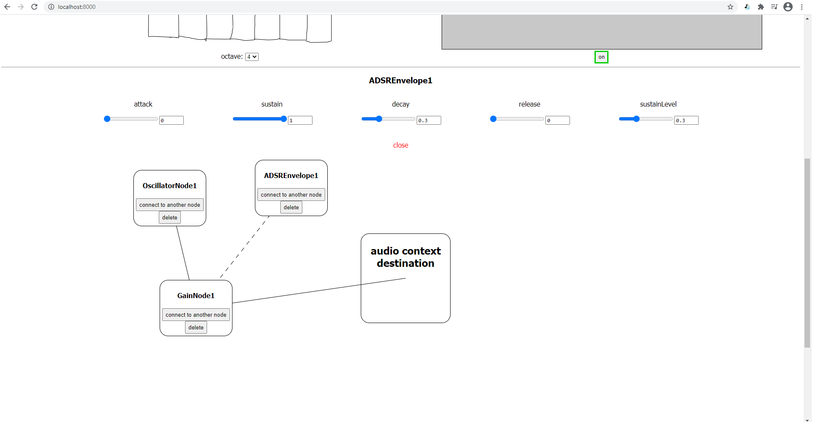

# soundmaker (WIP)    
check it out @ https://syncopika.github.io/soundmaker/    
    
    
    
the keyboard svg image used was created by me using Inkscape!    
    
This application is intended to be a companion to my piano-roll-browser application so that custom sounds can be integrated! :D    
feel free to try out your custom presets in my piano roll application: https://syncopika.github.io/piano_roll_browser/   
    
inspired by Luis Crespo's fantastic work here: https://lcrespom.github.io/live-coding/#synth    
    